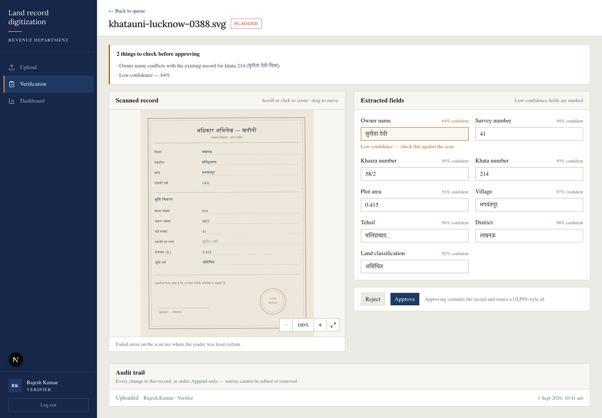
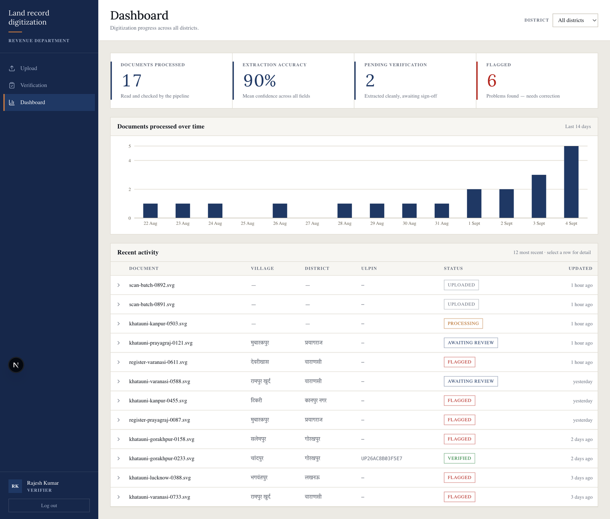
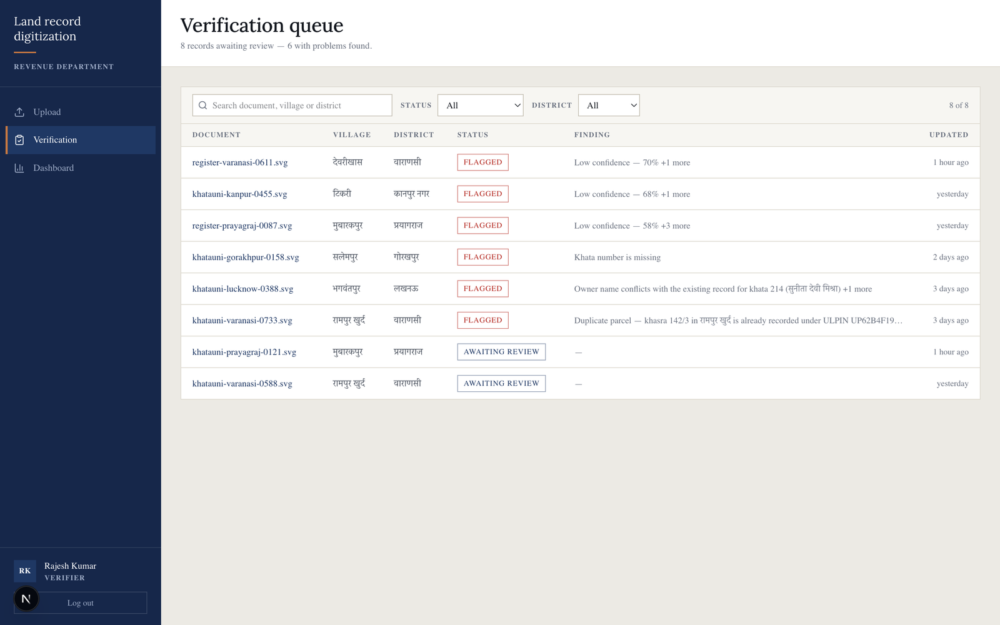
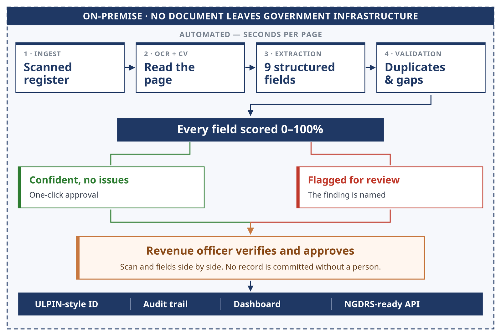

# VeriLekh-AI

**Intelligent land record digitization and validation system**
Smart India Hackathon 2026 · Problem Statement SIH26018 · Team Terra-Byte

An AI-assisted **back-office pipeline** that turns India's legacy paper land
records into clean, structured, validated digital records — with a human in the
loop and a full audit trail.

> **This is not a citizen-facing portal.** Bhulekh and NGDRS already let citizens
> search records that have *already* been digitized. What they don't solve is the
> undigitized backlog still sitting in paper form in tehsil and village offices.
> This system is the missing step *before* a record can appear on those portals.
> It feeds into NGDRS/DILRMP; it does not compete with them.


---

## The screens

Three screens, all working against a live database. All data shown is synthetic.

### Verification — scan and extracted fields side by side

The reviewer's screen. Low-confidence fields carry an amber border and a
percentage, the validation banner names the exact finding, and the scan can be
zoomed and panned to check a value against the page.



### Dashboard

Live figures from the database — documents processed, mean extraction accuracy,
records awaiting review and records flagged — with a 14-day trend and an
activity table whose rows expand in place.



### Verification queue

Everything awaiting a person, searchable and filterable, with the specific
finding shown per row rather than just a status.



## The problem

Across India a large share of land records still exist only as handwritten
registers, faded scans, cadastral maps and legacy PDFs. They are the legal basis
for ownership, taxation, acquisition and dispute resolution — yet converting them
to digital records is still done by hand: slow, costly and error-prone. Poor scan
quality, regional scripts and handwritten annotations make it worse.

## What the system does

```
Upload scan → OCR extracts text → fields are mapped to a structured record
   → each field gets a confidence score → validation flags problems
   → a human verifies the low-confidence fields → record is committed
   → ULPIN-style ID generated, action written to the audit trail
```

A record is only ever committed by a person. The AI narrows what that person has
to look at — it does not decide ownership.

**Capabilities** — what the system does by design. See
[build status](#build-status) below for what is implemented today.

- Document upload, single and batch, images and PDFs
- OCR text extraction through a swappable interface
- Extraction into nine structured fields: owner name, survey number, khasra
  number, khata number, plot area, village, tehsil, district, land classification
- Per-field confidence scoring, with low-confidence fields flagged for review
- A validation engine: missing-field checks, range checks, and duplicate or
  conflicting parcel detection
- ULPIN-style unique ID generated for each validated record
- Side-by-side human verification — scan on the left, editable fields on the right
- An append-only audit trail: every upload, edit, approval and rejection is
  recorded with actor and timestamp
- A dashboard of throughput, extraction accuracy, pending and flagged counts
- A simulated NGDRS/DILRMP integration endpoint, clearly labelled as such

## Who uses it

Internal government revenue staff — not the public.

| Role | Who | Can do |
|---|---|---|
| **Verifier** | Patwari / Lekhpal / data-entry clerk | Upload, run extraction, review, approve or reject |
| **Admin** | Supervising revenue officer | Everything a verifier does, plus dashboard and user management |
| **Viewer** | Auditor / senior official | Read-only dashboard — no upload, no edit |

---

## Architecture




| Layer | Choice | Why |
|---|---|---|
| Framework | Next.js 15, App Router | UI and API routes in one project — no separate server, no CORS, one deploy |
| Language | TypeScript, strict | Contract mismatches fail at compile time |
| Database | PostgreSQL 16, self-hosted in Docker | Land records are relational; running locally keeps data on your own infrastructure |
| ORM | Prisma | One schema file is the single source of truth for the data model |
| UI | Tailwind CSS v4 + shadcn/ui | Accessible prebuilt primitives instead of hand-rolled components |
| Auth | Auth.js (NextAuth v5), credentials provider | Email/password with a `role` claim on the session |
| OCR | Tesseract 5 (Hindi + English), self-hosted in Docker | Runs on your own hardware — see below |

### Data model

Five tables, all linked by foreign keys:

- **User** — email, bcrypt password hash, role
- **Document** — the uploaded file and its status (`UPLOADED` → `PROCESSING` →
  `FLAGGED`/`VERIFIED`/`REJECTED`)
- **ExtractedRecord** — the nine structured fields, the ULPIN, and a JSON
  confidence map of `{ field: 0.0–1.0 }`
- **ValidationResult** — pass/flagged/duplicate, the list of issues, and a
  pointer to the record it duplicates
- **AuditLog** — actor, action, before/after snapshots, timestamp

### OCR: real, and running on your own hardware

Text recognition runs in `ocr-service/` — a small FastAPI service using
**Tesseract 5** with the Hindi (Devanagari) and English language models,
started alongside the database by `docker compose up -d`.

It never touches the network. The language models are installed into the image
at build time and documents are read from a read-only mount of the application's
own upload directory, so **no document image is ever sent to a third-party API**
and the service works on a disconnected machine. That is what makes the
data-sovereignty position real rather than aspirational.

How a page is read:

1. The record is rasterised — SVG via cairo, legacy PDF via poppler at 300 dpi.
2. Contrast is stretched and strokes sharpened. Aged registers photograph with
   no true black or white; one sample page spans only grey 56–191 untouched.
3. Two recognition passes run over the page — Devanagari, and a digit-restricted
   Latin pass for survey, khasra and khata numbers — each at two page
   segmentation modes.
4. Words are merged into lines by position, so a label and its value rejoin.
   A line's confidence is the **lowest** of its words: printed labels always
   read cleanly, and averaging would hide uncertainty about the written value.

Measured on three sample records: **20 of 27 fields exactly correct, 25 of 27
populated.** The residual errors are Devanagari matra reordering by the engine
(`मलिहाबाद` read as `मलहिबाद`). Every incorrect field so far has scored below
the confidence threshold, so it is flagged and reaches a human — which is what
the verification workflow exists for.

The application only ever calls `runOcr()` in `src/lib/ocr.ts`, so a department
can substitute its own engine by exposing `POST /extract` returning
`{ rawText, language, blocks[] }` and pointing `OCR_SERVICE_URL` at it. Setting
`OCR_SERVICE_URL=mock` falls back to canned data for development without the
container running.

### Extraction runs on a queue, not in the request

Reading one page costs seconds of CPU. Doing that inside the HTTP request that
asks for it would hold a server thread open per page — a two-hundred-page
register uploaded as a batch would exhaust the pool and start timing out.

So uploading **enqueues** the document and returns immediately; a separate
worker process does the reading, and the screens poll for the result.

The queue is Postgres itself, claimed with `FOR UPDATE SKIP LOCKED`:

```sql
UPDATE "ExtractionJob"
   SET status = 'RUNNING', "startedAt" = now(), attempts = attempts + 1
 WHERE id = (
   SELECT id FROM "ExtractionJob" WHERE status = 'QUEUED'
    ORDER BY "createdAt" FOR UPDATE SKIP LOCKED LIMIT 1
 )
RETURNING id, "documentId", attempts
```

A worker locks exactly one waiting row and every other worker skips past it, so
copies can run concurrently and no job is ever handed out twice. This needs no
Redis and no message broker — the database a department already backs up holds
the queue too, and one fewer service has to stay alive in a district office.

Scale it with `docker compose up -d --scale worker=3`. Failed jobs are retried
three times, then parked as `FAILED` with the document returned to `UPLOADED`
so nothing is ever stranded mid-processing.

**Measured:** enqueuing 20 documents takes 0.16 s in total and the API keeps
answering in under 65 ms while the worker drains them. The same batch run
synchronously would have blocked for roughly a minute.

### Security and access

Two layers of enforcement, both required:

1. **Route protection.** Middleware redirects unauthenticated requests to the
   login page and keeps Viewers out of the upload and verification screens.
2. **Server-side authorization.** Every mutating API route re-checks the session
   role before acting. The client is never trusted — a Viewer calling the verify
   endpoint directly gets a `403`, even though the button is hidden in their UI.

Passwords are stored as bcrypt hashes, never plaintext. Sessions live in an
httpOnly cookie. Audit rows are append-only in practice — no delete or edit path
is exposed for them.

### Data sovereignty

Postgres runs in local Docker and uploaded scans stay in `./uploads`, so land
ownership data never leaves the machine it is running on. Because OCR is designed
to run against a self-hostable engine, document images need never be sent to a
third-party cloud AI.

> Land ownership data never leaves government-controlled infrastructure — no
> third-party API, no external data transmission.

**All seed and demo data is synthetic**: realistic in format, entirely fabricated
in content. Owner names, survey numbers and parcels are invented. Real citizens'
ownership records must never be loaded into this system.

---

## Running it

**Revenue staff never do any of this.** They are given a web address and a login
by their IT department, and that is the whole of their experience — the same as
any departmental system they already use. Everything below is for whoever
installs it, once.

### Installing it (one machine, one command)

Docker is the only prerequisite. The database, the text-recognition engine and
the application all ship as containers — there is no Node, Python, Postgres or
Tesseract to install on the server, and no versions to match.

```bash
git clone https://github.com/ASHVIK-SINHA-07/sih26018-VeriLekh-AI.git
cd sih26018-VeriLekh-AI
cp .env.example .env
echo "AUTH_SECRET=\"$(openssl rand -base64 32)\"" >> .env

docker compose up -d
```

That is the whole installation. Staff then open **https://** the address you
configured, and need only a browser and a login.

Set `SITE_ADDRESS` in `.env` to the hostname staff will actually type. A public
hostname (`landrecords.revenue.gov.in`) makes the proxy obtain and renew a real
certificate automatically; the default, `localhost`, makes it issue its own —
which is what a closed department network with no public DNS needs. Plain HTTP
is redirected to HTTPS, and HSTS, `X-Frame-Options`, `nosniff` and a referrer
policy are applied at the edge.

Only the proxy is reachable from the network. The application, the database and
the OCR service are bound to loopback and talk to each other over an internal
container network, so nothing on the department LAN can reach the database
directly.

Database migrations run automatically each time the application container
starts, so upgrading is `git pull && docker compose up -d --build`. The first
build takes a few minutes while the OCR image is assembled; after that the
system starts in seconds and **needs no internet connection at all** — the
language models are inside the image.

### Running it for development

If you are changing the code rather than deploying it:

```bash
npm install
docker compose up -d db ocr          # just the supporting services
npx prisma migrate dev --name init
npx prisma db seed                   # optional — synthetic demo data
npm run dev                          # http://localhost:3000
```

Node.js 22.6 or later is required for development; the seed script runs
TypeScript natively.

### Demo data

`npx prisma db seed` loads three role accounts and twenty synthetic records,
including four deliberately planted problems — a duplicate parcel, a mismatched
owner, a missing field, and a faded scan with low-confidence fields — so the
validation engine has something real to catch.

**The seed prints its account credentials to your terminal.** They are
development-only fixtures and are deliberately not published here. Never run the
seed against an internet-facing deployment.

Every record is synthetic: realistic in format, invented in content. No real
citizen's land record exists anywhere in this repository.

### Environment variables

| Key | Purpose |
|---|---|
| `DATABASE_URL` | Postgres connection string (matches `docker-compose.yml`) |
| `AUTH_SECRET` | Auth.js session secret — generate per environment, never commit |
| `OCR_SERVICE_URL` | `http://localhost:8001` (the bundled OCR service), or `mock` for offline development |
| `UPLOAD_DIR` | Local directory for uploaded scans (`./uploads`) |
| `SITE_ADDRESS` | Hostname the system is served on; drives certificate issuance |
| `ADMIN_EMAIL` | Certificate-expiry notices, for a public hostname |

`.env` is gitignored; `.env.example` documents every key with placeholder values.

---

## Repository layout

```
├── prisma/
│   ├── schema.prisma       data model — the single source of truth
│   ├── seed.ts             synthetic seed data
│   └── migrations/
├── src/
│   ├── app/                pages and API routes (App Router)
│   ├── components/         shared UI components
│   ├── lib/                db client, auth, OCR interface, extraction,
│   │                       validation, ULPIN generator
│   ├── types/              shared types matching the API contract
│   └── middleware.ts       route protection
├── ocr-service/            self-hosted OCR (Tesseract, FastAPI, Docker)
├── src/worker.ts           background worker draining the extraction queue
├── scripts/                development tooling
├── assets/                 screenshots used in this README
├── Caddyfile               TLS termination and security headers
├── Dockerfile              the web application container
├── docker-compose.yml      database + OCR + application + worker + proxy
└── uploads/                stored scans (gitignored)
```

---

## Project status

Measured against the eleven capabilities the problem statement asks for.

### Working today

```
Document ingestion — images and legacy PDFs      ██████████  complete
Self-hosted OCR, no third-party service          ██████████  complete
Field extraction into structured records         ██████████  complete
Per-field confidence scoring                     ██████████  complete
Validation — missing, range, duplicate, conflict ██████████  complete
Human verification workflow                      ██████████  complete
Append-only audit trail                          ██████████  complete
Role-based access control                        ██████████  complete
Dashboards and reporting                         ██████████  complete
REST API for onward integration                  ██████████  complete
Asynchronous extraction queue with retries        ██████████  complete
Responsive layout — phone, tablet, desktop       ██████████  complete
HTTPS with automatic certificates                ██████████  complete
```

Extraction accuracy, measured across seventeen test documents: **95% of fields
populated, 66% exactly correct**, and **84% of the remaining errors are
automatically flagged** for human review rather than committed silently. The
fields that legally identify a parcel do best — khata number 100%, khasra 94%,
district 94%, survey number 88%, plot area 88%. Devanagari name fields are
weaker and are where the confidence gate earns its place.

### Partially built

```
Language coverage — Hindi/Devanagari only        ████░░░░░░  one of many
Registry integration — contract built, simulated ████░░░░░░  no live endpoint
```

The OCR engine is reached through a single swappable interface, so adding a
language is a configuration change rather than a rewrite. The integration
endpoint returns correctly-shaped data from real records but is clearly labelled
as simulated and contacts no government system.

### Not started — the roadmap

```
Handwriting recognition                          ░░░░░░░░░░  planned
Learning from corrections                        ░░░░░░░░░░  data captured
Cadastral maps and GIS geometry                  ░░░░░░░░░░  planned
Encryption at rest, SSO, multi-tenancy           ░░░░░░░░░░  planned
```

Two of these are closer than they look. **Handwriting** needs a different
recognition model behind the existing interface, not new architecture — the
current engine reads printed Devanagari well and routes anything it cannot read
confidently to a human, so handwritten annotations are flagged rather than
mis-transcribed. **Learning from corrections** already has its groundwork: every
correction an officer makes is stored with its before and after value, which is
exactly the labelled data a future model would train on. Nothing consumes it yet.

Cadastral map digitization is the largest gap and the most valuable next step —
official figures put national map digitization at roughly 68% complete against
95% for textual records, so the geometry side of the backlog is where the
remaining work actually is.
